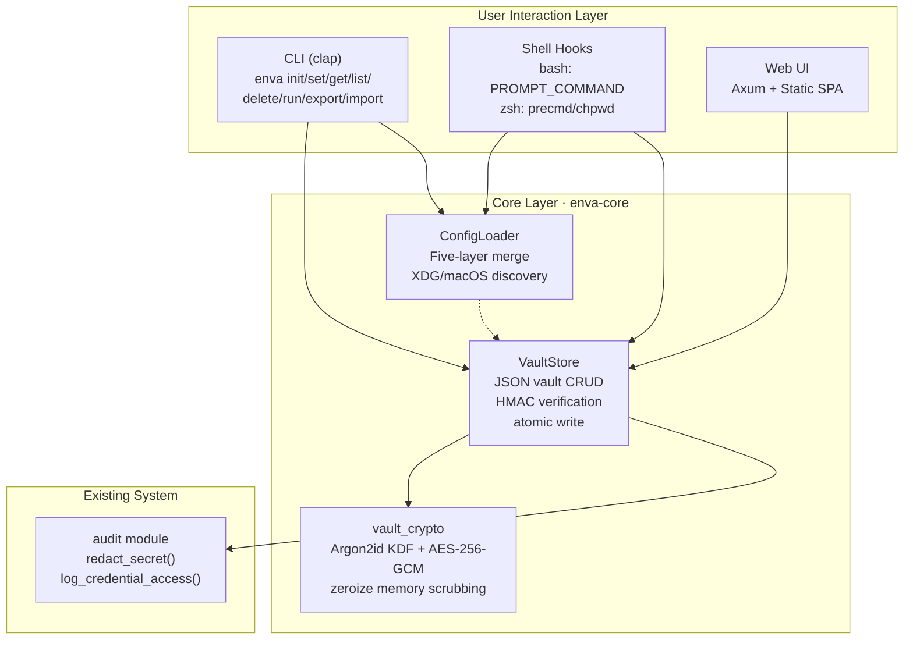
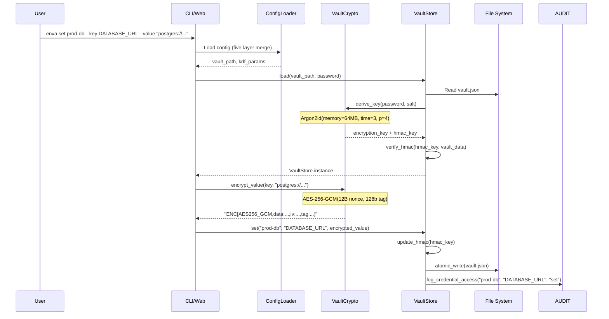
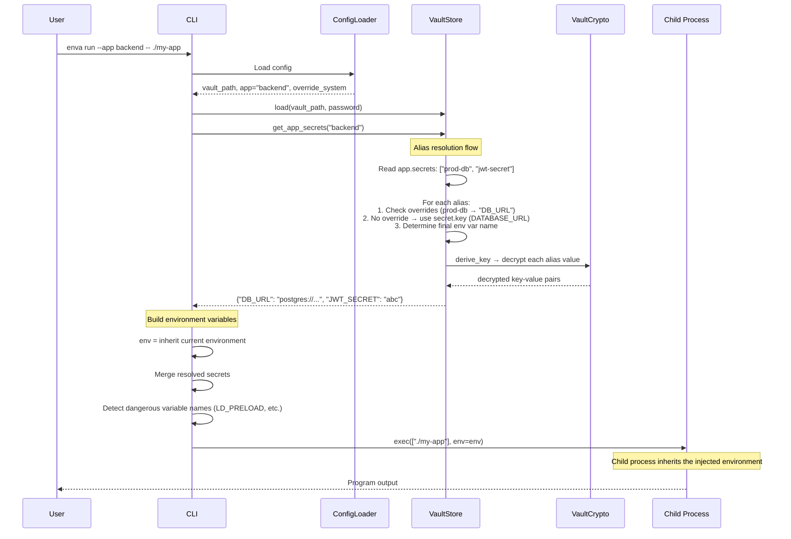
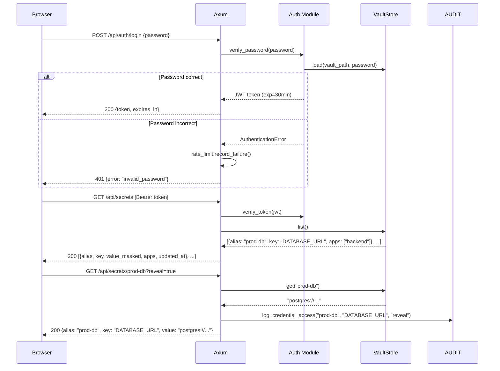

# Enva Architecture Design

> **摘要 (ZH):** Enva 密钥管理器总体架构文档。纯 Rust 实现：加密操作由 Rust 完成（Argon2id KDF + AES-256-GCM），应用层同样由 Rust 实现。对每个值进行加密，存储在可移植的 JSON vault 中。包含五层配置层级、clap CLI（10 个子命令）、bash/zsh Shell hooks、Axum Web UI。支持 x86_64 Linux + aarch64 macOS 平台。单一二进制部署。

---

## 1. Architecture Overview

### 1.1 Module Layout



### 1.2 Dependency Direction

```
User Interaction Layer  →  Core Layer (enva-core)  →  Crypto primitives (argon2, aes-gcm)
                                ↓
                  Audit module               File System (vault.json, config.yaml)
```

**Dependency rules**:
- The core layer does not depend on the user interaction layer (unidirectional dependency)
- The core layer handles all cryptographic operations natively in Rust using `argon2` and `aes-gcm` crates
- The `enva-core` crate is the library; the `enva` crate is the binary
- User interaction layers do not depend on each other

---

## 2. Data Flows

### 2.1 Encrypted Storage Flow



### 2.2 Environment Variable Injection Flow (Alias Resolution Model)



### 2.3 Web Management Flow



### 2.4 Web UI Page Design

> Desktop-first design, minimum width 1024px. Narrow screens (< 768px) degrade to single-column layout with the sidebar collapsed into a top dropdown selector.

*(Web UI wireframes remain the same as the original design — see api_spec.md for full page layouts.)*

---

## 3. Security Threat Model

| # | Threat | Attack Vector | Severity | Countermeasures |
|---|--------|---------------|----------|-----------------|
| T1 | **Password brute force** | Offline password guessing after obtaining the vault file | High | Argon2id KDF (64 MB memory, 3 iterations) makes each attempt take ≥200 ms; increasing `memory_cost` further raises the cost |
| T2 | **Vault file tampering** | Modifying encrypted values or swapping values between keys | High | HMAC-SHA256 covering all key-value pairs + `_meta` fields; per-value AAD binding to key path prevents value swapping |
| T3 | **Plaintext exposure in memory** | Core dump / process memory read reveals decrypted secrets | Medium | Rust uses the `zeroize` crate for explicit zeroing of decryption buffers; `secrecy::SecretString` wraps sensitive values |
| T4 | **Shell history leakage** | `enva set KEY VALUE` recorded in .bash_history | Medium | Shell hooks enable `HISTCONTROL=ignorespace` / `HIST_IGNORE_SPACE`; `enva set` supports `--password-stdin` for piped input; value argument should be provided via interactive prompt |
| T5 | **Unauthorized Web UI access** | Remote attacker accessing the web management interface | High | Bound to `127.0.0.1` by default (local only); JWT authentication + rate limiting (5 failures → 300 s lockout); CORS whitelist |
| T6 | **Vault file accidentally committed to git** | .vault.json picked up by git add | Medium | Install script auto-appends `*.vault.json` and `.enva.yaml` to .gitignore; `enva init` checks .gitignore |
| T7 | **Password cache theft** | Cached password in memory read by another process | Low | Default `password_cache: memory` (in-process, 5-minute timeout); configurable as `none` (prompt every time) |

### Known Limitations

1. **Single-user model**: The current design uses a single password to unlock the entire vault—no multi-user RBAC. For team scenarios, a platform-level solution such as Infisical or HashiCorp Vault is recommended.
2. **No audit log signing**: `audit.log` is a plaintext log that can be tampered with. If tamper-proof auditing is needed, an external append-only log system is recommended.

---

## 4. Crate Structure

### 4.1 Package Layout

**`enva-core` (library crate)**:

```
crates/enva-core/
├── Cargo.toml                  # argon2, aes-gcm, zeroize, secrecy, serde, etc.
├── src/
│   ├── lib.rs                  # Crate entrypoint, re-exports
│   ├── crypto.rs               # AES-256-GCM encryption engine
│   ├── vault_crypto.rs         # Argon2id KDF + vault-level crypto
│   ├── store.rs                # VaultStore: vault file CRUD + HMAC
│   ├── file_backend.rs         # File-based storage backend
│   ├── types.rs                # Core domain types
│   ├── profile.rs              # Multi-account profile management
│   ├── resolver.rs             # Credential resolution pipeline
│   └── audit.rs                # Audit logging interface
└── benches/
    └── crypto_bench.rs         # Cryptographic benchmarks
```

**`enva` (binary crate)**:

```
crates/enva/
├── Cargo.toml                  # Depends on enva-core, clap, axum, jsonwebtoken
├── src/
│   ├── main.rs                 # CLI entrypoint (clap command group)
│   ├── config.rs               # ConfigLoader: five-layer config merge
│   ├── vault.rs                # Vault operations bridge
│   └── web/
│       ├── mod.rs              # Axum application
│       ├── auth.rs             # JWT authentication + rate limiting
│       └── routes.rs           # API routes
└── web/
    └── index.html              # SPA frontend assets
```

### 4.2 Core Interfaces

**VaultStore**:
- `create(path: &Path, password: &str, kdf_params: Option<KdfParams>) -> Result<VaultStore>`
- `load(path: &Path, password: &str) -> Result<VaultStore>`
- `save() -> Result<()>` — Atomic write (tempfile + rename)
- `set(alias: &str, key: &str, value: &str, description: &str, tags: &[String]) -> Result<()>`
- `get(alias: &str) -> Result<String>` — Decrypt by alias
- `delete(alias: &str) -> Result<()>` — Remove from pool (and all app references)
- `list(app: Option<&str>) -> Result<Vec<SecretInfo>>`
- `assign(app: &str, alias: &str, override_key: Option<&str>) -> Result<()>`
- `unassign(app: &str, alias: &str) -> Result<()>`
- `get_app_secrets(app: &str) -> Result<HashMap<String, String>>`

**ConfigLoader**:
- `load(config_path: Option<&str>, env_name: Option<&str>) -> Config` — Five-layer merge
- `discover_project_config() -> Option<PathBuf>` — Walk upward searching for .enva.yaml
- `resolve_vault_path() -> PathBuf` — Resolve vault path by priority

---

## 5. Document Cross-Reference Index

| Document | Path | Key Content |
|----------|------|-------------|
| Research Report | `research/{en,zh}/tools_survey.md` | 12-tool comparison matrix, four-dimension pattern analysis, recommended approach |
| Current State Analysis | `research/{en,zh}/codebase_analysis.md` | Rust crate inventory, gap analysis, integration points |
| Technology Selection | `design/{en,zh}/tech_decision.md` | Architecture decisions, dependency inventory |
| **Architecture Design** | **`design/{en,zh}/architecture.md`** | **This document — module diagrams, data flows, Web UI design, threat model** |
| Vault Format Specification | `design/{en,zh}/vault_spec.md` | JSON schema, ENC encoding, KDF parameters, HMAC, version evolution |
| Configuration Reference | `design/{en,zh}/config_reference.md` | Five-layer config field definitions, merge rules, discovery logic |
| API Specification | `design/{en,zh}/api_spec.md` | CLI command tree, shell hook specification, Web API endpoints, Web UI page routes |
| Deployment Plan | `design/{en,zh}/deployment.md` | Platform matrix, installation workflow, CI matrix |

---

*Document version: 4.0 | Updated: 2026-03-28 | Architecture: Pure Rust (enva-core lib + enva binary)*
