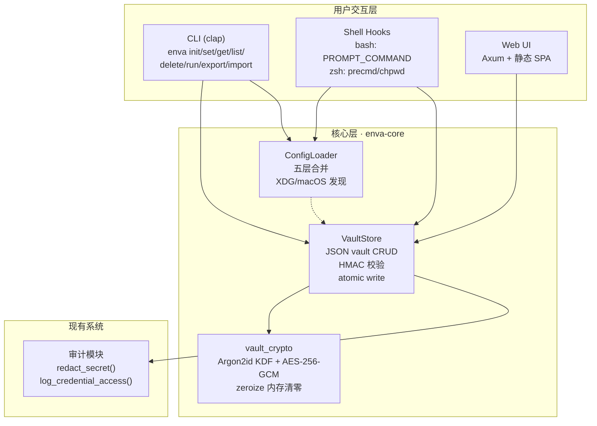
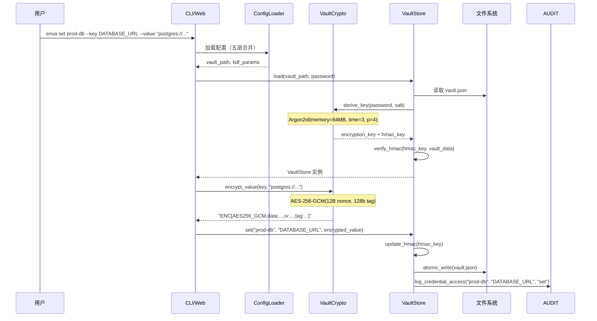
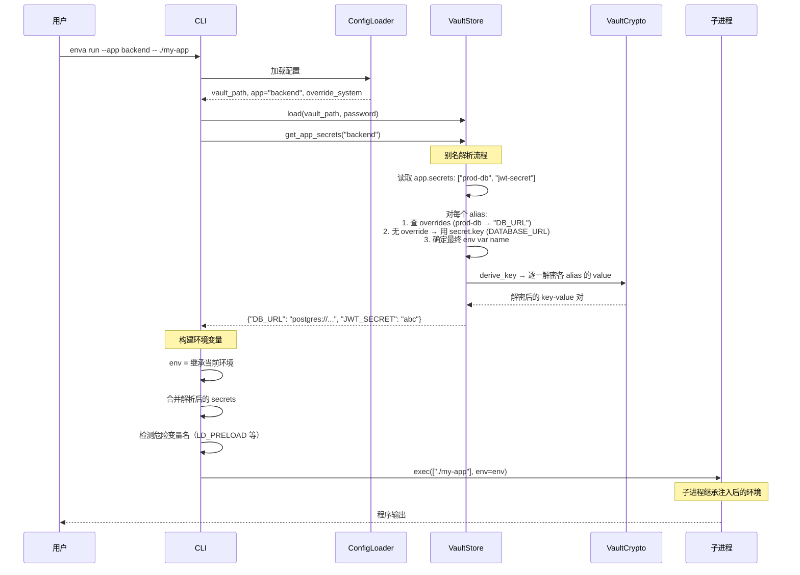
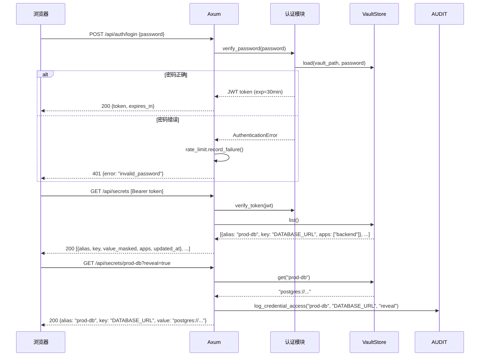

# Enva 密钥管理系统架构设计

> **Summary (EN):** Master architecture document for the Enva secrets manager. Pure Rust implementation: cryptographic operations (Argon2id KDF + AES-256-GCM) and the entire application layer are implemented in Rust. Per-value encryption in a portable JSON vault. Five-layer config hierarchy, clap CLI (10 subcommands), bash/zsh shell hooks, Axum Web UI. Supports x86_64 Linux + aarch64 macOS. Single binary deployment.

---

## 1. 架构总览

### 1.1 模块划分



### 1.2 依赖方向

```
用户交互层  →  核心层 (enva-core)  →  加密原语 (argon2, aes-gcm)
                    ↓
              审计模块               文件系统（vault.json, config.yaml）
```

**依赖规则**:
- 核心层不依赖用户交互层（单向依赖）
- 核心层使用 `argon2` 和 `aes-gcm` crate 原生处理所有加密操作
- `enva-core` 是库 crate；`enva` 是二进制 crate
- 用户交互层之间互不依赖

---

## 2. 数据流

### 2.1 加密存储流程



### 2.2 环境变量注入流程（别名解析模型）



### 2.3 Web 管理流程



### 2.4 Web 管理界面设计

> 桌面优先设计，最小宽度 1024px。窄屏（< 768px）降级为单列布局，侧栏折叠为顶部下拉选择器。

*（Web UI 线框图与原始设计一致——完整页面布局见 api_spec.md。）*

---

## 3. 安全威胁模型

| # | 威胁 | 攻击向量 | 严重度 | 防御措施 |
|---|------|---------|--------|---------|
| T1 | **密码暴力破解** | 获取 vault 文件后离线尝试密码 | 高 | Argon2id KDF (64MB memory, 3 iterations) 使每次尝试耗时 ≥200ms；增加 memory_cost 可进一步提升代价 |
| T2 | **Vault 文件篡改** | 修改加密值或交换不同 key 的值 | 高 | HMAC-SHA256 覆盖所有 key-value 对 + _meta 字段；per-value AAD 绑定 key path 防止值互换 |
| T3 | **内存中明文泄露** | core dump / 进程内存读取暴露解密后的 secrets | 中 | Rust 使用 `zeroize` crate 显式清零解密缓冲区；`secrecy::SecretString` 封装敏感值 |
| T4 | **Shell history 泄露** | `enva set KEY VALUE` 命令被记录到 .bash_history | 中 | Shell hooks 启用 `HISTCONTROL=ignorespace` / `HIST_IGNORE_SPACE`；`enva set` 支持 `--password-stdin` 管道输入；value 参数建议通过 prompt 交互输入 |
| T5 | **Web UI 未授权访问** | 远程攻击者访问 Web 管理界面 | 高 | 默认绑定 `127.0.0.1`（仅本地）；JWT 认证 + rate limiting (5 次失败锁定 300 秒)；CORS 白名单 |
| T6 | **Vault 文件意外提交到 git** | .vault.json 被 git add | 中 | 安装脚本自动添加 `*.vault.json` 和 `.enva.yaml` 到 .gitignore；`enva init` 检查 .gitignore |
| T7 | **密码缓存被窃取** | 内存中缓存的密码被其他进程读取 | 低 | 默认 `password_cache: memory`（进程内，5 分钟超时）；可配置为 `none`（每次都问） |

### 已知限制

1. **单用户模型**: 当前设计为单密码解锁整个 vault，无多用户 RBAC。团队场景建议使用 Infisical/Vault 等平台级方案。
2. **无审计日志签名**: `audit.log` 为明文日志，可被篡改。如需不可篡改审计，建议外部 append-only 日志系统。

---

## 4. Crate 结构

### 4.1 包布局

**`enva-core`（库 crate）**:

```
crates/enva-core/
├── Cargo.toml                  # argon2, aes-gcm, zeroize, secrecy, serde 等
├── src/
│   ├── lib.rs                  # Crate 入口，re-exports
│   ├── crypto.rs               # AES-256-GCM 加密引擎
│   ├── vault_crypto.rs         # Argon2id KDF + vault 级加密
│   ├── store.rs                # VaultStore: vault 文件 CRUD + HMAC
│   ├── file_backend.rs         # 文件存储后端
│   ├── types.rs                # 核心领域类型
│   ├── profile.rs              # 多账户 Profile 管理
│   ├── resolver.rs             # 凭证解析管线
│   └── audit.rs                # 审计日志接口
└── benches/
    └── crypto_bench.rs         # 加密性能基准测试
```

**`enva`（二进制 crate）**:

```
crates/enva/
├── Cargo.toml                  # 依赖 enva-core, clap, axum, jsonwebtoken
├── src/
│   ├── main.rs                 # CLI 入口（clap 命令组）
│   ├── config.rs               # ConfigLoader: 五层配置合并
│   ├── vault.rs                # Vault 操作桥接
│   └── web/
│       ├── mod.rs              # Axum 应用
│       ├── auth.rs             # JWT 认证 + rate limiting
│       └── routes.rs           # API 路由
└── web/
    └── index.html              # SPA 前端资源
```

### 4.2 核心接口

**VaultStore**:
- `create(path: &Path, password: &str, kdf_params: Option<KdfParams>) -> Result<VaultStore>`
- `load(path: &Path, password: &str) -> Result<VaultStore>`
- `save() -> Result<()>` — atomic write (tempfile + rename)
- `set(alias: &str, key: &str, value: &str, description: &str, tags: &[String]) -> Result<()>`
- `get(alias: &str) -> Result<String>` — 按 alias 解密取值
- `delete(alias: &str) -> Result<()>` — 从密钥池删除（同时移除所有 app 引用）
- `list(app: Option<&str>) -> Result<Vec<SecretInfo>>`
- `assign(app: &str, alias: &str, override_key: Option<&str>) -> Result<()>`
- `unassign(app: &str, alias: &str) -> Result<()>`
- `get_app_secrets(app: &str) -> Result<HashMap<String, String>>`

**ConfigLoader**:
- `load(config_path: Option<&str>, env_name: Option<&str>) -> Config` — 五层合并
- `discover_project_config() -> Option<PathBuf>` — 向上搜索 .enva.yaml
- `resolve_vault_path() -> PathBuf` — 按优先级解析 vault 路径

---

## 5. 文档交叉引用索引

| 文档 | 路径 | 关键内容 |
|------|------|---------|
| 调研报告 | `research/{en,zh}/tools_survey.md` | 12 工具对比矩阵、四维度模式分析、推荐方案 |
| 现状分析 | `research/{en,zh}/codebase_analysis.md` | Rust crate 清单、差距分析、集成点 |
| 技术选型 | `design/{en,zh}/tech_decision.md` | 架构决策、依赖清单 |
| **架构设计** | **`design/{en,zh}/architecture.md`** | **本文档 — 模块图、数据流、Web UI 设计、威胁模型** |
| Vault 格式规范 | `design/{en,zh}/vault_spec.md` | JSON schema、ENC 编码、KDF 参数、HMAC、版本演进 |
| 配置参考 | `design/{en,zh}/config_reference.md` | 五层配置字段定义、合并规则、发现逻辑 |
| 接口规范 | `design/{en,zh}/api_spec.md` | CLI 命令树、Shell hook 规范、Web API endpoints、Web UI 页面路由 |
| 部署方案 | `design/{en,zh}/deployment.md` | 平台矩阵、安装流程、CI matrix |

---

*文档版本: 4.0 | 更新时间: 2026-03-28 | 架构: 纯 Rust (enva-core lib + enva binary)*
